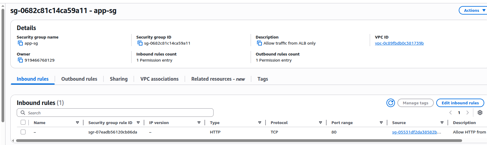
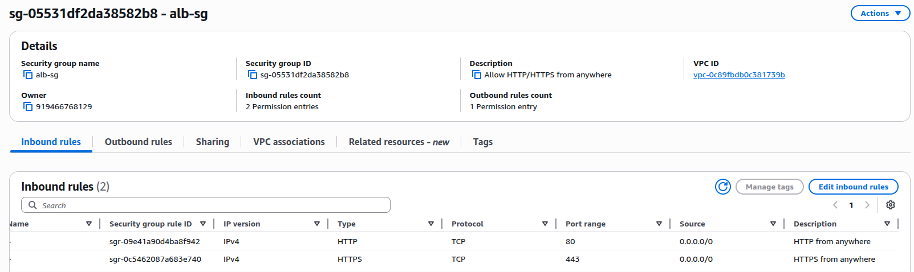
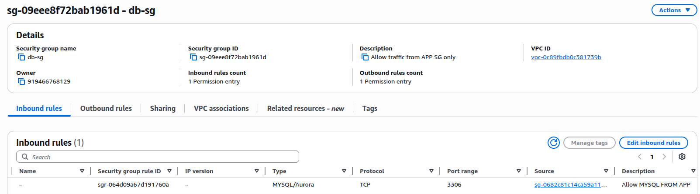
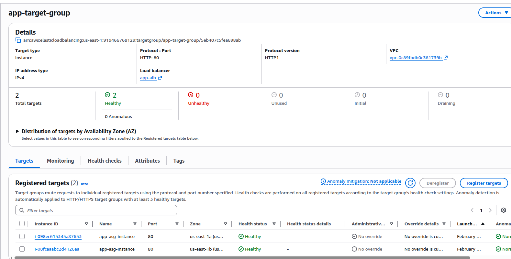
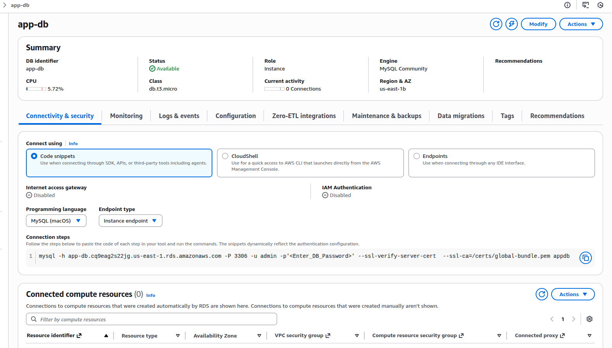

# Multi-Tier Web Application on AWS using Terraform

This project deploys a **3-tier web application architecture** on AWS using Terraform with a focus on **high availability (HA)**, **security**, and **modular design**. It includes a **VPC**, **Application Load Balancer (ALB)**, **EC2 Auto Scaling Group**, and **RDS database**.

---

## 🌐 Architecture Overview

The system is composed of:

1. **VPC & Subnets**
2. **Security Groups**
3. **Application Load Balancer (ALB)**
4. **EC2 Auto Scaling Group**
5. **RDS Database**

*Project Architecure.*

---

## 📂 Project Structure

aws-multi-tier-webapp-terraform/
├── modules/
│ ├── vpc/
│ ├── security-groups/
│ ├── alb/
│ ├── ec2-asg/
│ └── rds/
└── environments/
└── dev/
├── main.tf
├── variables.tf
├── terraform.tfvars
└── backend.tf

---

## 🖼 Screenshots

These images demonstrate that the infrastructure is deployed correctly:

### 1️⃣ VPC & Subnets

*Shows public, private, and DB subnets.*

### 2️⃣ Security Groups
*Inbound/outbound rules for ALB, App, and DB tiers.*

#### 2️⃣.1 Security Group

*Inbound/outbound rules for App tier.*
#### 2️⃣.2 Security Group

*Inbound/outbound rules for ALB tier.*
#### 2️⃣.3 Security Groups

*Inbound/outbound rules for DB tier.*

### 3️⃣ ALB Configuration

*Public ALB with listeners and target group.*

### 4️⃣ Target Group & Health Checks

*All EC2 instances registered and healthy.*

### 5️⃣ EC2 Instances / Auto Scaling

*Shows running instances across multiple AZs.*

### 6️⃣ RDS Database

*Multi-AZ private database with endpoint.*

### 7️⃣ SSM Session

*Connection to EC2 without SSH.*

---

## ⚙️ How to Deploy

1. Initialize Terraform:
    cd aws-multi-tier-webapp-terraform/environments/dev
    `terraform init`
2. Validate configuration:
    `terraform validate`
3. Preview plan:
    `terraform plan`
4. Apply changes:
    `terraform apply`

## 🧪 Testing & Validation
1. Check Terraform outputs

2. Open ALB DNS in browser

3. Verify Target Group health

4. Connect to EC2 via SSM

5. Test Auto Scaling by terminating instance

6. Connect from EC2 to RDS

7. Verify security rules (DB private, SG restrictions)